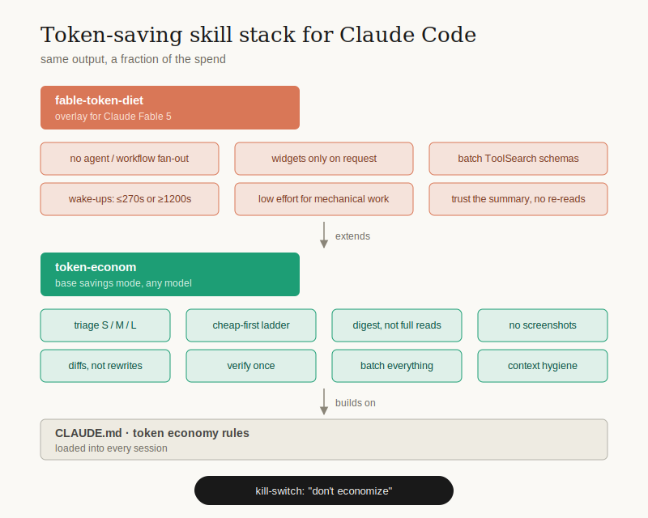

# claude-fable-token-diet

A two-layer skill stack for [Claude Code](https://claude.com/claude-code) on **Claude Fable 5 / the Claude 5 family** that cuts token spend 3–10x without cutting output quality. The base layer works on any Claude model; the overlay targets what's new (and newly expensive) in Fable.



## Why

Claude Code is powerful and hungry. Left alone it will read whole directories, spawn subagents for questions two greps could answer, render widgets nobody asked for, and re-verify things a tool result already confirmed. On the Claude 5 family (Fable/Mythos) the new orchestration primitives — Workflow fan-out, deferred tool schemas, scheduled wake-ups — add fresh ways to burn money.

These two skills install a hard budget discipline. Every rule came from a real bill.

## The stack

### 1. `token-econom` — base savings mode (any model)

| Rule | What it does |
|---|---|
| Triage S / M / L | zero tool calls for answerable questions; a 30-second file plan before real work |
| Cheap-first ladder | script/CLI → `grep -n` → digest → targeted Read → full Read → ONE subagent. Never skip down |
| Digest, not full reads | `scripts/digest.sh` prints line count + signatures at ~5% of a full-read cost |
| Images are contraband | no screenshots unless it's the only way or the user asked; one image ≈ 1.5–2k tokens re-sent every turn |
| Output diet | diffs instead of file rewrites, `file:line` instead of quote-backs, verdict first |
| Verify once | cheapest signal (exit code, one grep, one test) — no verification theater |
| Batch everything | independent tool calls in one block, questions in one message |
| Context hygiene | new task → new chat; suggest `/compact`; "this is Sonnet-level, switch models" |

### 2. `fable-token-diet` — overlay for Claude Fable 5 / Claude 5

Only what's new or newly expensive in the Claude 5 family:

| Rule | What it does |
|---|---|
| No agent/workflow fan-out | Workflow tool only on explicit command; Fable loves orchestration — suppress the reflex |
| Widgets only on request | text + a table is 10–50x cheaper than a rendered widget or artifact |
| Batch ToolSearch | load deferred tool schemas in ONE `select:A,B,C` call, never one at a time |
| Cache-aware wake-ups | ScheduleWakeup ≤270s (prompt cache alive) or ≥1200s — never 300–900s, that's a pure cache-miss tax |
| Effort routing | mechanical work → tell the user to switch down; subagents get `effort: 'low'` for mechanical stages |
| Trust the summary | after context compaction, don't re-read files "to be sure" |

### Kill-switch

Say **"don't economize"** (or explicitly ask for a workflow / widget / screenshot) and the rules lift for that request. Savings mode should never fight the user.

## Install

```bash
git clone https://github.com/voronezh00136-bit/claude-fable-token-diet.git
cp -r claude-fable-token-diet/skills/token-econom ~/.claude/skills/
cp -r claude-fable-token-diet/skills/fable-token-diet ~/.claude/skills/
```

Both skills auto-invoke on multi-step tasks (see their `description` frontmatter). `fable-token-diet` only matters on Fable/Mythos sessions; on Sonnet/Haiku the base skill alone is enough. Skip `fable-token-diet` if you don't run the Claude 5 family.

Optional but recommended: add a short "token economy" section to your `~/.claude/CLAUDE.md` so the core rules survive even when skill routing misses. The skills are the enforcement layer; CLAUDE.md is the constitution.

## Layout

```
skills/
  token-econom/
    SKILL.md            # base savings mode
    scripts/digest.sh   # file structure at ~5% of full-read cost
  fable-token-diet/
    SKILL.md            # Claude 5 overlay (in Russian — rules are model-facing, translate freely)
assets/
  token-diet-stack.svg  # the diagram above
```

## License

MIT
